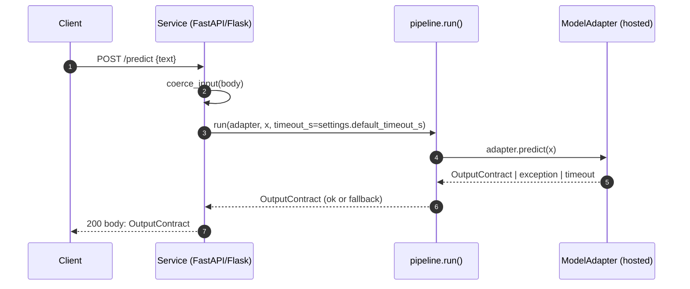
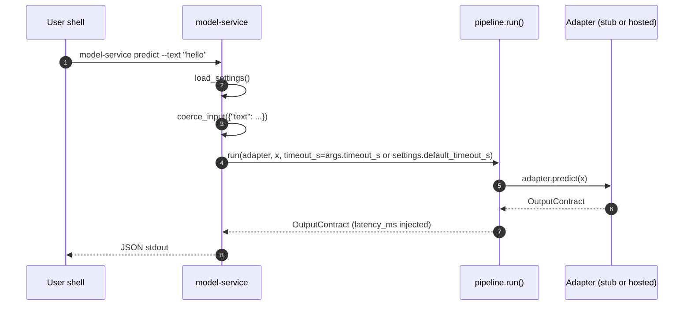

# model-service

A production-oriented CLI template for integrating and evaluating ML models inside a software service.

I care about software that's easier to build, change, and reason about.

## Why
Most ML examples focus on the model.
This repo focuses on the system around the model: contracts, failure modes,
evaluation, and maintainability.

When a model becomes a dependency, the surrounding software still needs to be:
- predictable under change
- safe under failure
- easy to reason about

## What this repo includes
- A model adapter interface (the model is swappable)
- Explicit contracts for model inputs and outputs
- A small evaluation runner suitable for CI
- Safe fallback behavior when models fail
- Tests for the boring parts (where incidents usually come from)

## Architecture (high level)

```
input
|
v
contracts --> pipeline --> model adapter
|
+-- validation
+-- timeout / error handling
+-- fallback
|
v
contract-valid output
```

## Quickstart
Requires Python 3.11+

Install:
- `pip install -e ".[dev]"`

Run a single prediction:
- `model-service predict --text "hello world"`

Validate a dataset:
- `model-service validate --dataset src/model_service/eval/datasets/tiny.jsonl`

Run evaluation:
- `model-service eval --dataset src/model_service/eval/datasets/tiny.jsonl`

## Testing
- Preferred (installs package): `pip install -e ".[dev]" && pytest`
- Offline/locked network workaround: `PYTHONPATH=src pytest`

## Getting started scenarios

### Local stub (fastest path)
- Install the repo in editable mode: `pip install -e ".[dev]"`
- Run a single prediction with the deterministic stub adapter: `model-service predict --text "hello world"`
- Try the tiny sample dataset end-to-end: `model-service eval --dataset src/model_service/eval/datasets/tiny.jsonl`

### Target adapter with auth
- Implement an HTTP adapter that satisfies `ModelAdapter` (see `src/model_service/model/base.py`). Use an API token from the environment and forward the validated contract to your hosted model endpoint.
- Wire it into `_get_adapter` in `src/model_service/cli.py` (e.g., `MODEL_SERVICE_ADAPTER=hosted` to select it) so the CLI exercises the same code as the service.
- Keep contract enforcement at the edge: `x = coerce_input(request.json)` before calling `run(adapter, x, timeout_s=settings.default_timeout_s)` in your HTTP handler.

### Full CI recipe (validate → eval → enforce thresholds → export)
1) Validate inputs early:
   - `model-service validate --dataset src/model_service/eval/datasets/tiny.jsonl`
2) Run evaluation and capture the report:
   - `model-service eval --dataset src/model_service/eval/datasets/tiny.jsonl > eval-report.json`
3) Enforce thresholds in CI with a tiny gate (adjust numbers as needed):
   - ```
     python - <<'PY'
     import json, sys
     r = json.load(open('eval-report.json'))
     assert r['failed'] == 0, 'failures present'
     assert r['p95_ms'] < 1500, 'p95 latency too high'
     PY
     ```
4) Export the report artifact to your CI system (e.g., `eval-report.json` as a build artifact or PR comment). This keeps performance history close to code changes.

## HTTP request/response sequence diagrams

### Service endpoint (recommended shape)


### CLI parity


## Configuration knobs (service + CLI parity)
- `MODEL_SERVICE_ADAPTER` (default: `stub`): select which adapter `_get_adapter` returns. Use the same env var in your HTTP service process so CLI + service exercise identical code paths.
- `MODEL_SERVICE_TIMEOUT_S` (default: `2.0`): shared timeout for `pipeline.run`. CLI can override per-call via `--timeout-s`; services should plumb the env-derived default into their handler.
- Add adapter-specific env vars (e.g., `MODEL_SERVICE_API_URL`, `MODEL_SERVICE_API_TOKEN`) inside your adapter implementation; both the CLI and service will consume them when `_get_adapter` constructs the adapter, keeping behaviors aligned.

## Principles
- The system is the product
- Explicit contracts beat implicit assumptions
- Make failure modes boring
- Optimize for change

For design rationale, see [`DESIGN.md`](DESIGN.md).
